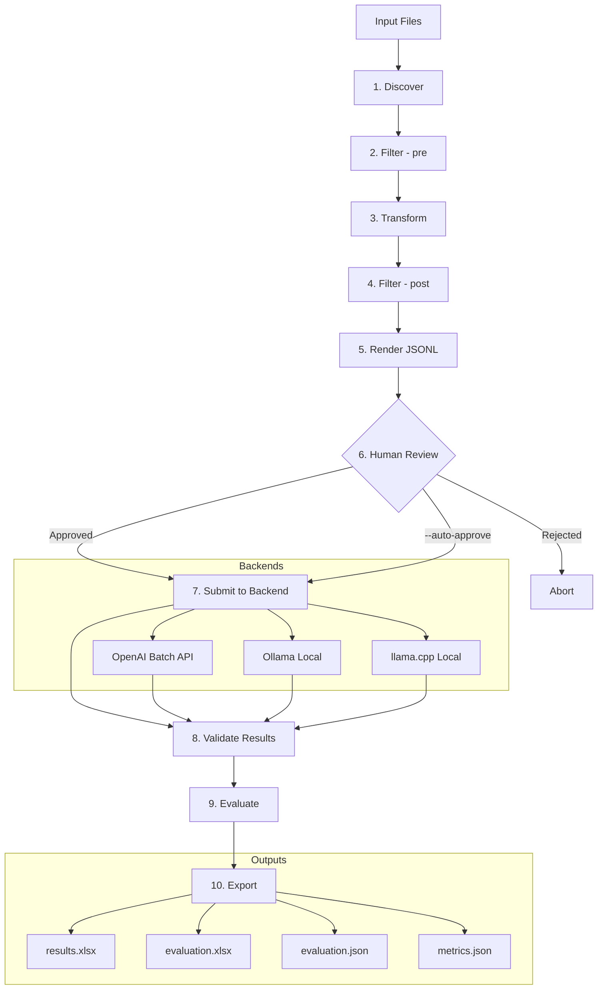

# LLM Batch Pipeline

`llm-batch-pipeline` is a generic LLM batch processing pipeline. It discovers and parses input files via a plugin system, renders OpenAI Batch API (or Ollama / llama.cpp) requests, validates structured JSON outputs with a Pydantic schema, evaluates predictions against ground truth, and exports results to XLSX/JSON.

See the **Getting Started Guide** for a tested end-to-end walkthrough with OpenAI Batch API and a 3-way sharded Ollama setup ([docs/getting-started.md](docs/getting-started.md)). For native llama.cpp, see the benchmark guide and server notes in [`docs/running-llamacpp.md`](docs/running-llamacpp.md). See the **User Guide** for installation and CLI reference ([docs/user-guide.md](docs/user-guide.md)). See the **Admin Guide** for installation/deployment, and the **Developer Guide** for how to extend the pipeline with custom plugins, prompts, schemas, and evaluation.

## Workflow


## Admin / Install
- Admin guide: [`docs/admin-guide.md`](docs/admin-guide.md)
- Install (example): `uv sync`

## Requirements
- OpenAI backend: set `OPENAI_API_KEY`.
- Local LLM via Ollama: run an Ollama server (pull the model), then use `--backend ollama --base-url http://HOST:11434` (repeat `--base-url` for multi-server sharding).
- Local LLM via llama.cpp: run a native `llama-server`, then use `--backend llamacpp --llamacpp-endpoint chat --base-url http://HOST:18100`.
- OpenAI API compatible local server (if supported by your server): use `--backend openai` and configure the OpenAI SDK base URL (commonly via `OPENAI_BASE_URL`).

## Getting Started
- End-to-end walkthrough: [`docs/getting-started.md`](docs/getting-started.md)
- The getting-started guide was tested against live OpenAI Batch and Ollama services.

## Quick Test (offline)
Run the unit test suite (no external LLM services):
```bash
uv sync --group dev
uv run pytest -q
```

## Plugins
List registered plugins:
```bash
uv run llm-batch-pipeline list
```

The built-in examples include `spam_detection` and `gdpr_detection`.

## Test / Benchmark
- Sequential Ollama vs. vLLM benchmark runbook: [`docs/benchmark-run.md`](docs/benchmark-run.md)
- vLLM-specific guide: [`docs/running-vllm.md`](docs/running-vllm.md)
- Ollama sharding guide: [`docs/running-ollama.md`](docs/running-ollama.md)
- llama.cpp native guide: [`docs/running-llamacpp.md`](docs/running-llamacpp.md)
- Backend comparison guide: [`docs/backend-comparison.md`](docs/backend-comparison.md)

## Architecture
- [`docs/architecture.md`](docs/architecture.md)

## Extend (plugins)
- [`docs/developer-guide.md`](docs/developer-guide.md)
- Developer guide covers: custom prompt, custom Pydantic schema, and custom evaluation.

## Monitor
- Prometheus metrics + Grafana: [`docs/admin-guide.md`](docs/admin-guide.md)

## License
- EUPL (v1.2): [see `LICENSE`](LICENSE)
