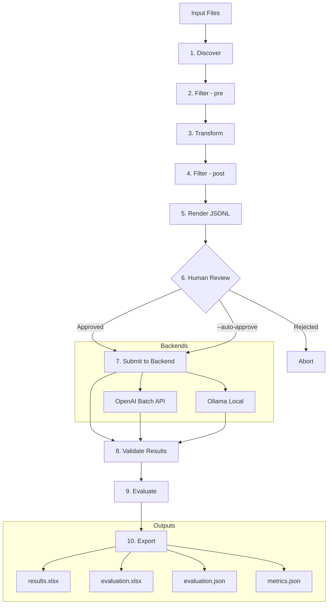
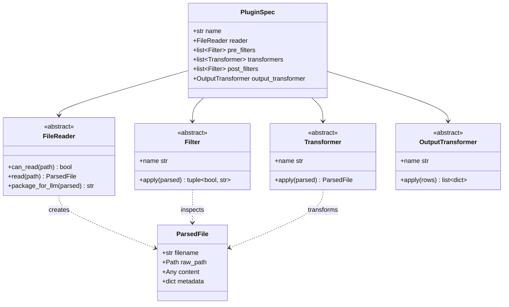
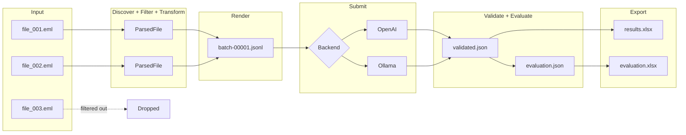
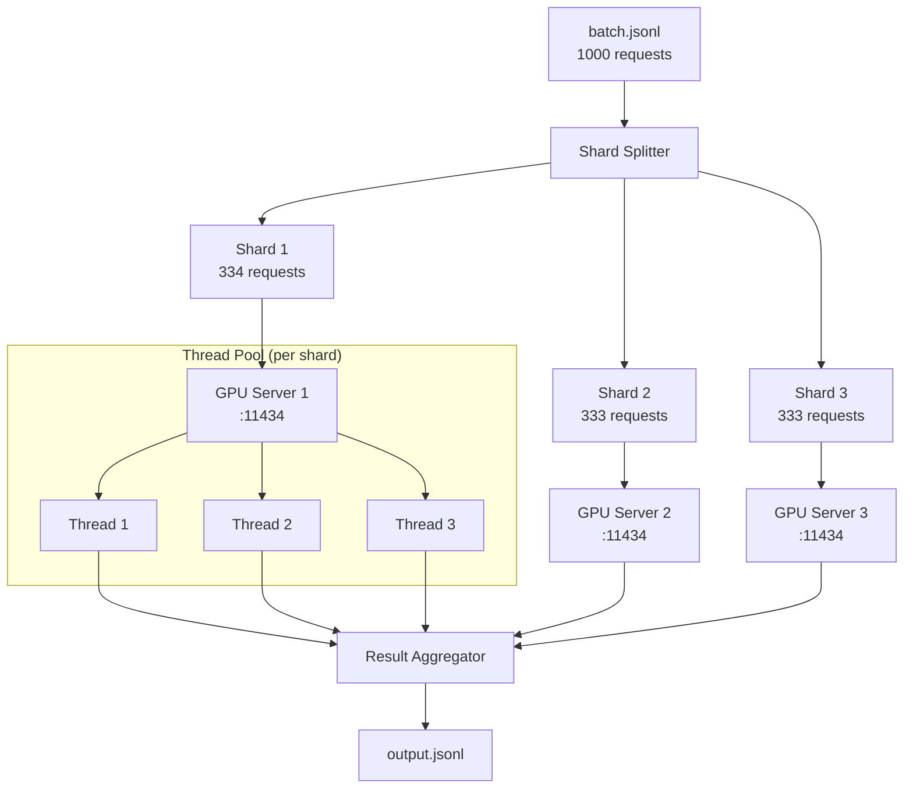
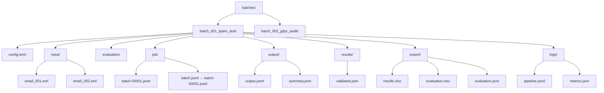
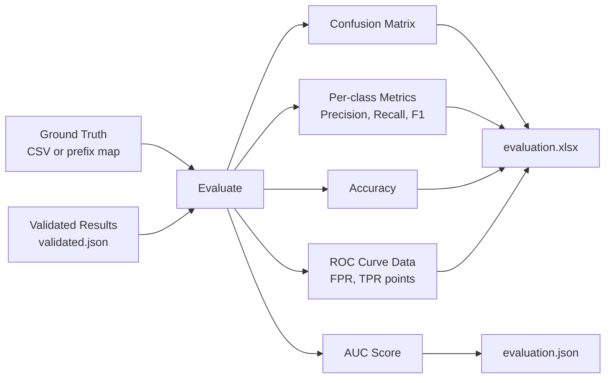

# LLM Batch Pipeline — Architecture

Visual workflow diagrams for the pipeline stages and data flow.

## Pipeline Flow

## Plugin System

## Data Flow

## Ollama Multi-Server Sharding

## Batch Directory Structure

## Evaluation Output

